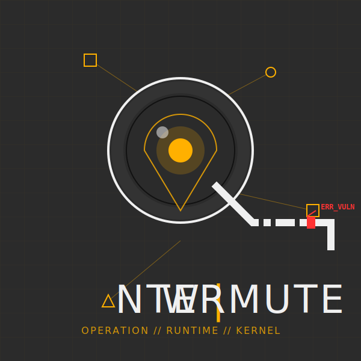

[](https://github.com/nahualito/wintermute/actions/workflows/ci.yml)
[](https://www.python.org/downloads/release/python-3110/)
[](https://www.python.org/downloads/release/python-3120/)
[](https://www.python.org/downloads/release/python-3130/)



# Wintermute

**Wintermute** is a comprehensive cybersecurity assessment framework and library designed for managing complex operations involving Hardware, Cloud (AWS), and Systems security. It bridges the gap between manual penetration testing management and AI-driven automation.

It serves as both a state management engine for security operations and a runtime environment for AI agents (LLMs) to interact with physical hardware (via tools like Depthcharge), cloud infrastructure, and ticketing systems.

---

## Usage

Access to console can be done from the `wintermuteConsole` executable

```bash
./wintermuteConsole
```

If you want to run in a Docker, make sure you have Docker installed and run:

```bash
docker build -t wintermute .
```

And then run:

```bash
docker run -it --rm -v $(pwd):/opt/wintermute
```

This will add the current folder as a volume to the docker container so you can save your work.

## 🚀 What does it do?

Wintermute provides a structured object model to represent a Security Operation (Pentest). It tracks:

- **Assets:** Devices, Servers, Cloud Accounts (AWS), and Users.
- **Hardware:** Processors, Architectures (ARM, x86, RISC-V), and Peripherals (UART, JTAG, TPM).
- **Findings:** Vulnerabilities, reproduction steps, and risk scoring.
- **Orchestration:** Declarative Test Plans and automated Test Runs.

It allows you to spin up an `Operation`, attach an AI Agent (using Bedrock, OpenAI, or Groq), and have that agent query manuals (RAG), interact with U-Boot consoles, or manage tickets in an external tracker, all while maintaining a consistent state.

---

## 🛠 Design & Architecture

Wintermute is designed as a modular hardware offensive framework to manage security operations, pentests, and device analysis. The core of Wintermute is built around several key classes that represent the main entities in a security operation, including Operations, Pentests, Analysts, Devices, Services, Vulnerabilities, and Risks. Each class encapsulates relevant attributes and methods to manage its data and relationships with other classes.

The entire framework allows you to create "cartridges," which are modular plugins that can extend the functionality of Wintermute. Cartridges can be developed to add support for specific hardware, protocols, or offensive techniques, making Wintermute a flexible and extensible platform for security professionals. The cartridges can be loaded and unloaded dynamically, allowing users to customize their environment based on the specific requirements of their security operations.

The current class structure is the following:

```mermaid
---
config:
  layout: elk
---
classDiagram
    class WintermuteConsole {
        +__init__(*args, **kwargs)
        +cmdloop()
        +load(cartridge_name: str)
        +unload(cartridge_name: str)
        +run_script(path: str)
        +run_pyscript(path: str)
        +do_load(ns: argparse.Namespace)
        +do_unload(ns: argparse.Namespace)
        +do_run_script(ns: argparse.Namespace)
        +do_run_pyscript(ns: argparse.Namespace)
    }
    class Operation {
        +__init__(name: str="", metadata: Dict=None)
        +add_analyst(a: Analyst)
        +add_device(d: Device)
        +add_pentest(p: Pentest)
        +to_dict() -> Dict
        +from_dict(data: Dict) -> Operation
    }
    class Pentest {
        +__init__(name: str="", metadata: Dict=None)
        +add_device(d: Device)
        +add_service(s: Service)
        +add_vulnerability(v: Vulnerability)
        +to_dict() -> Dict
    }
    class Analyst {
        +__init__(name: str="", userid: str="", email: str="")
    }
    class Device {
        +__init__(name: str="", metadata: Dict=None)
        +add_service(s: Service)
        +add_peripheral(p: Peripheral)
        +to_dict() -> Dict
    }
    class Service {
        +__init__(name: str="", port: int=0, protocol: str="")
        +add_vulnerability(v: Vulnerability)
        +to_dict() -> Dict
    }
    class Vulnerability {
        +__init__(title: str="", severity: str="", description: str="")
        +to_dict() -> Dict
    }
    class Risk {
        +__init__(level: str="", description: str="")
        +to_dict() -> Dict
    }
    class DBController {
        +__init__(backend: str="tinydb")
        +connect()
        +save(obj)
        +load(query) -> Any
    }
    class Cartridge {
        <<interface>>
        +load()
        +unload()
        +run(*args, **kwargs)
    }
    class BaseModel {
        +__init__(**kwargs)
        +to_dict() -> Dict
        +from_dict(data: Dict)
        +save(db: DBController)
    }
    class Peripheral {
        +__init__(name: str="", pins: Dict=None, pType: PeripheralType=...)
        +to_dict() -> Dict
    }
    class PeripheralType {
        <<enum>>
        +UART
        +Wifi
        +Ethernet
        +JTAG
        +Bluetooth
        +TPM
    }
    class UART {
        +__init__(name: str="", pins: Dict=None, baudrate: int=9600, bytesize: int=8, parity: str="N", stopbits: int=1, comPort: str="")
        +open()
        +close()
        +send(bytes)
        +receive() -> bytes
    }
    class Wifi {
        +__init__(name: str="", pins: Dict=None, SSID: str="", password: str="", encryption: str="WPA2", band: str="2.4GHz", ipaddress: str="127.0.0.1")
        +connect()
        +disconnect()
        +scan() -> List[Dict]
    }
    class Ethernet {
        +__init__(name: str="", pins: Dict=None, mac_address: str="", ipaddress: str|IPv4Address|IPv6Address=None, subnet_mask: str="", gateway: str="", dns: str="", speed: str="1Gbps", duplex: str="full")
        +configure()
        +up()
        +down()
    }
    class JTAG {
        +__init__(...)
        +connect()
        +reset()
    }
    class Bluetooth {
        +__init__(...)
        +pair()
        +scan()
    }
    class TPMPeripheral {
        +__init__(...)
        +init()
        +send_command(cmd)
    }

    Peripheral <|-- UART
    Peripheral <|-- Wifi
    Peripheral <|-- Ethernet
    Peripheral <|-- JTAG
    Peripheral <|-- Bluetooth
    Peripheral <|-- TPMPeripheral
    class Finding {
        +__init__(title: str="", description: str="", severity: str="", references: List=None)
        +to_dict() -> Dict
        +from_dict(data: Dict) -> Finding
        +format() -> str
    }
    class ParserUtil {
        +parse_device(payload: str) -> Device
        +parse_service(payload: str) -> Service
        +parse_peripheral(payload: str) -> Peripheral
    }
    class FindingUtil {
        +parse_finding(payload: str) -> Finding
        +format_finding(f: Finding) -> str
        +export_findings(findings: List[Finding], format: str="json")
    }
    class RiskUtil {
        +calculate_risk(vuln: Vulnerability) -> Risk
        +score_to_level(score: int) -> str
    }
    class BugzillaBackend {
        +create_ticket(finding: Finding) -> str
        +update_ticket(ticket_id: str, data: Dict)
    }
    class DOCXReports {
        +render_report(operation: Operation) -> bytes
        +save(path: str)
    }
    class TPM20Cartridge {
        +load()
        +unload()
        +fuzz(params: Dict)
        +provision()
    }
    class IoTCartridge {
        +load()
        +unload()
        +scan_devices() -> List[Device]
    }
    Operation "1" o-- "*" Analyst
    Operation "1" o-- "*" Device
    Operation "1" o-- "*" Pentest
    Pentest "1" o-- "*" Device
    Pentest "1" o-- "*" Service
    Device "1" o-- "*" Service
    Device "1" o-- "*" Peripheral
    Service "1" o-- "*" Vulnerability
    Vulnerability "1" o-- "1" Risk
    Cartridge <|.. TPM20Cartridge
    Cartridge <|.. IoTCartridge
    ParserUtil ..> Device
    ParserUtil ..> Service
    FindingUtil ..> Finding
    RiskUtil ..> Risk
```



### Core Domain

The heart of Wintermute is the `Operation` class. It acts as the central repository for all state.

```python
from wintermute.core import Operation, Device, Analyst
from wintermute.hardware import Architecture, Processor

# 1. Initialize an Operation
op = Operation("Project_Neuromancer")

# 2. Add Assets
op.addDevice(
    hostname="gibson_mainframe",
    ipaddr="192.168.1.55",
    operatingsystem="Irix",
    architecture=Architecture.MIPS,
    processor=Processor.R4000
)

# 3. Add Staff
op.addAnalyst(name="Case", userid="console_cowboy", email="case@wintermute.ai")

# 4. Save State (Persistence is backend-agnostic)
op.save()

```

### Storage Backends

Wintermute decouples the logic from where data is stored. You can switch backends seamlessly.

- **JsonFileBackend:** Stores operations as local `.json` files. Great for local dev.
- **DynamoDBBackend:** Stores operations in AWS DynamoDB. Ideal for collaborative, distributed teams.

```python
from wintermute.core import Operation
from wintermute.backends.json_storage import JsonFileBackend
from wintermute.backends.dynamodb import DynamoDBBackend

# Local Development
Operation.register_backend("local", JsonFileBackend("./data"), make_default=True)

# Production
Operation.register_backend("cloud", DynamoDBBackend(table_name="OpsTable"))

# Switch context at runtime
Operation.use_backend("cloud")

```

---

## 🎫 The Ticket System (Metaclass Magic)

Wintermute uses a sophisticated **Metaclass-based** design for Ticket management. This allows the `Ticket` class to behave like a static interface (`Ticket.create(...)`) while delegating logic to interchangeable backends (Jira, Bugzilla, In-Memory) without changing the calling code.

### Usage

The `Ticket` class uses a Protocol to enforce backend compliance.

```python
from wintermute.tickets import Ticket, InMemoryBackend, Status

# 1. Register a backend (e.g., In-Memory for testing)
Ticket.register_backend("mem", InMemoryBackend(), make_default=True)

# 2. Create a Ticket (Backend handles the ID generation and storage)
t_id = Ticket.create(
    title="UART Root Shell",
    description="Root shell accessible via UART on J5 header.",
    status=Status.OPEN
)

# 3. Interact with it
Ticket.comment(t_id, text="Verified on v2.0 firmware", author="Case")
ticket_obj = Ticket.read(t_id)

print(f"{ticket_obj.ticket_id}: {ticket_obj.data.title}")

```

### Creating a Custom Backend

Implement the `TicketBackend` protocol:

```python
class MyJiraBackend:
    def create(self, data: TicketData) -> str:
        # Call Jira API...
        return "JIRA-123"

    def read(self, ticket_id: str): ...
    def update(self, ticket_id: str, fields: dict): ...
    def add_comment(self, ticket_id: str, comment: Comment): ...

```

---

## 🤖 AI Integration & Tools

Wintermute includes a runtime for AI agents (`wintermute.ai`), supporting providers like AWS Bedrock, OpenAI, and Groq. It features a **Tool Registry** that allows functions to be exposed to the LLM automatically.

### Tool Registration

Functions are decorated or manually registered. The `ToolsRuntime` handles execution, supporting both local Python functions and remote MCP tools.

```python
from wintermute.ai.tools_runtime import tools, Tool
from wintermute.ai.json_types import JSONObject

def my_custom_tool(args: JSONObject) -> JSONObject:
    return {"status": "hacked"}

# Register so the AI knows about it
tools.register(
    Tool(
        name="exploit_target",
        input_schema={"type": "object", "properties": {}},
        output_schema={"type": "object"},
        handler=my_custom_tool,
        description="Exploits the target."
    )
)

```

### 🧠 RAG (Hardware Oracle)

The `wintermute.ai.utils.aws_rag` module integrates **LlamaIndex** with **AWS Bedrock**. It allows the AI to query ingested technical manuals (PDFs of datasheets, schematics).

- **Embeddings:** Titan Embed Text v2
- **LLM:** Claude 3.5 Sonnet
- **Usage:** The AI automatically calls `query_manuals_handler` when asked technical questions about chips or protocols.

---

## 🔌 Integrations

### 1. Surgeon (MCP Support)

Wintermute supports the **Model Context Protocol (MCP)** via the `SurgeonBackend`.

- **What it is:** Runs a separate process (the Surgeon server) that exposes tools to Wintermute.
- **Benefit:** Allows the AI to execute dangerous or complex tools in an isolated environment or a different language context.
- **Usage:** The `ToolsRuntime` dynamically fetches tools from the connected Surgeon server and exposes them to the LLM.

### 2. Depthcharge (Hardware Hacking)

Integration with the **Depthcharge** library allows automated U-Boot interactions.

- **Agent:** `DepthchargePeripheralAgent`
- **Capabilities:**
- Catalog U-Boot commands (`help`).
- Identify dangerous commands (memory write, flash erase).
- Dump RAM to files.

- **Auto-Vulnerability:** Automatically creates `Vulnerability` objects in the Operation if dangerous configurations (like unrestricted `md` or `mw`) are found.

```python
from wintermute.backends.depthcharge import DepthchargePeripheralAgent
from wintermute.peripherals import UART

uart = UART(comPort="/dev/ttyUSB0", baudrate=115200)
agent = DepthchargePeripheralAgent(uart, arch="arm")

# Scans console, finds dangerous commands, adds Vulnerability to Operation
agent.catalog_commands_and_flag()

```

---

## 📋 Test Plans & Test Runs

Wintermute moves beyond ad-hoc testing with a declarative Test Plan system.

1. **Test Plan:** A JSON definitions of _what_ to test (e.g., "Check SSH Strength").
2. **Target Scope:** A query language to select targets (e.g., `kind="device", where={"os": "Linux"}`).
3. **Test Case:** Combines steps + scope.
4. **Test Run:** An instance of a test case executed against a specific target.

**Workflow:**

1. Define a plan (e.g., `TestPlans/TP-HW-BLACKBOX-001.json`).
2. Load it into the Operation.
3. Generate Runs:

```python
op.addTestPlan(my_plan)
# Resolves bindings (finds all Linux devices) and creates execution records
op.generateTestRuns()

```

4. Execute: The AI or a human updates the status of the `TestCaseRun` (Passed/Failed) and adds `Findings`.

---

## 📠 Reporting

Reports are generated using `wintermute.backends.docx_reports` (implied). It takes the structured data from `Operation`, `TestRuns`, and `Vulnerabilities` to populate Word document templates (`templates/report_main.docx`).

---

## 🔌 Supported Peripherals

Defined in `wintermute/peripherals.py`, these classes model physical interfaces attached to Devices:

- **UART** (Universal Asynchronous Receiver-Transmitter)
- **JTAG** (Joint Test Action Group)
- **Wifi** (Wireless interfaces, SSID config)
- **Ethernet** (MAC, IP, Speed)
- **Bluetooth** (Paired devices, MAC)
- **USB** (Version, Role)
- **PCIe** (Lanes, Version, attached Processors)
- **TPM** (Trusted Platform Module - includes logic for PCR reading/extending)

---

## 📚 Documentation

Documentation is built using **MkDocs**.

1. Ensure you have the dev dependencies installed.
2. Run the build command:

```bash
mkdocs serve

```

3. Navigate to `http://127.0.0.1:8000`.

See `mkdocs.yml` for configuration.

---

## 👨‍💻 Development

We follow strict coding standards including Type Hinting (MyPy), Linting (Ruff/Pylint), and Formatting (Black).

Please refer to [DEVELOPMENT.md](DEVELOPMENT.md) for setting up your environment, running tests, and contribution guidelines.
