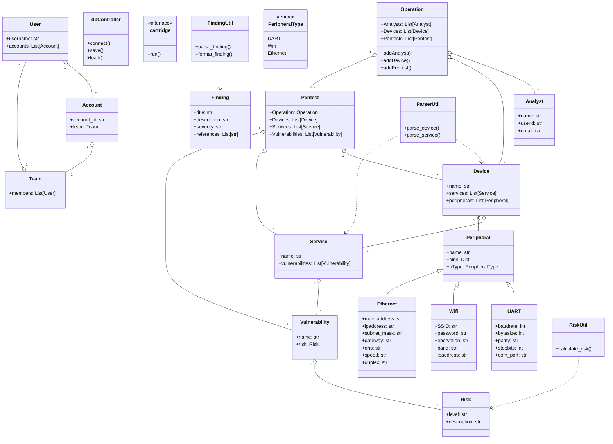

[](https://github.com/nahualito/wintermute/actions/workflows/ci.yml)
[](https://www.python.org/downloads/release/python-3110/)
[](https://www.python.org/downloads/release/python-3120/)
[](https://www.python.org/downloads/release/python-3130/)


# Welcome to wintermute’s documentation!

## Usage

Access to console can be done from the `wintermuteConsole` executable

```bash
./wintermuteConsole
```

If you want to run in a Docker, make sure you have Docker installed and run:

```bash
docker build -t wintermute .
```

And then run:

```bash
docker run -it --rm -v $(pwd):/opt/wintermute
```

This will add the current folder as a volume to the docker container so you can save your work.

# Design

Wintermute is designed as a modular hardware offensive framework to manage security operations, pentests, and device analysis. The core of Wintermute is built around several key classes that represent the main entities in a security operation, including Operations, Pentests, Analysts, Devices, Services, Vulnerabilities, and Risks. Each class encapsulates relevant attributes and methods to manage its data and relationships with other classes.

The entire framework allows you to create "cartridges," which are modular plugins that can extend the functionality of Wintermute. Cartridges can be developed to add support for specific hardware, protocols, or offensive techniques, making Wintermute a flexible and extensible platform for security professionals. The cartridges can be loaded and unloaded dynamically, allowing users to customize their environment based on the specific requirements of their security operations.

The current class structure is the following:



## What does it do now?

Wintermute is a hardware offensive framework designed for rapid prototyping and management of security operations, pentests, and device analysis. It provides a modular architecture where users can define and manage operations, analysts, devices, services, vulnerabilities, and risks, all linked through a central data model. The framework supports extensibility via "cartridges," which are plugin-like modules for hardware and offensive extensions (such as TPM 2.0 fuzzing or IoT device analysis). Users interact with Wintermute primarily through its REPL console (./wintermuteConsole), which allows loading and unloading cartridges, managing operations, and executing custom commands in a streamlined workflow.

As a library, Wintermute can be imported into Python projects to leverage its core classes and utilities for building custom security automation, device management, or vulnerability tracking solutions. End users can instantiate and manipulate objects such as Operation, Pentest, Device, and Peripheral directly in code, or use the REPL for interactive management. The framework supports both standard and star-import patterns, exposing modules and classes while keeping the environment clean. Data can be saved and loaded from various database backends, and documentation is provided via Sphinx for easy integration and extension. This makes Wintermute suitable for both interactive use and as a foundation for building advanced security tooling.

The current utility modules are:

- utils.parserUtil: Utilities for parsing device and service information.
- utils.findingUtil: Utilities for parsing and formatting findings.
- utils.riskUtil: Utilities for calculating risk levels.

The current backend modules are:

- bugzilla: Bugzilla backend for issue tracking.
- docxreports: DOCX report generation backend.

The current "cartridges" are:

- tpm20: TPM 2.0 library to talk and setup fuzzing for the TPMs

Currently peripherals supported are:

- UART: Universal Asynchronous Receiver-Transmitter interface for serial communication.
- Wifi: Wireless network interface for connecting to Wi-Fi networks.
- Ethernet: Wired network interface for Ethernet connections.
- JTAG: Joint Test Action Group interface for debugging and programming hardware devices.
- Bluetooth: Wireless technology for short-range communication between devices.
- TPM: Trusted Platform Module for secure cryptographic operations and storage.

The framework has abstraction classes such as Ticket() to manage tickets from different backends (Bugzilla, JIRA, etc) and Database backends such as TinyDB, SQLite, or others to store the data. it also supports Report() to manage report generation in different formats (HTML, DOCX, PDF, etc).

## User requirements

The library should be able to be imported in both "import wintermute", "from wintermute import \*", and "from wintermute import core".

Importing as a normal library and showing the classes and objects including "core", "database" and "wintermute" modules and objects inside of it.

```python
Python 3.10.6 (main, Aug 11 2022, 13:49:25) [Clang 13.1.6 (clang-1316.0.21.2.5)] on darwin
Type "help", "copyright", "credits" or "license" for more information.
>>> import wintermute
>>> c = wintermute.wintermute()
>>> f = wintermute.core.
wintermute.core.Analyst(         wintermute.core.Operation(       wintermute.core.Query()
wintermute.core.TinyDB(          wintermute.core.ipaddress        wintermute.core.re
wintermute.core.vulnerability()
wintermute.core.Device(          wintermute.core.Pentest(         wintermute.core.Service(
wintermute.core.User()           wintermute.core.logging          wintermute.core.uuid
>>> f = wintermute.
wintermute.abspath(   wintermute.basename(  wintermute.core
wintermute.database   wintermute.dirname(   wintermute.isfile(
wintermute.join(      wintermute.wintermute  wintermute.path
>>> f = wintermute.database.
wintermute.database.CommandSet()            wintermute.database.TinyDB(
wintermute.database.cmd2                    wintermute.database.logging
wintermute.database.with_category(
wintermute.database.Query()                 wintermute.database.argparse
wintermute.database.dbBackend(              wintermute.database.with_argparser(
wintermute.database.with_default_category(
>>> quit()
```

Also it allows for \* importing, this still will only import modules and not the functions to remove the possibility of having a "dirty environment" and function overrides.

```python
>>> from wintermute import *
>>> c = wintermute.wintermute()
>>> f = core.Analyst('Enrique Sanchez', 'nahualito', 'nahual@exploit.ninja')
>>> core.
core.Analyst(         core.Device(          core.Operation(
core.Pentest(         core.Query()          core.Service(
core.TinyDB(          core.User()           core.ipaddress
core.logging          core.re               core.uuid             core.vulnerability()
>>> wintermute.
wintermute.CommandSet()            wintermute.Operation(              wintermute.basename(
wintermute.cmd2                    wintermute.dirname(                wintermute.importlib
wintermute.isfile(                 wintermute.modules                 wintermute.sys
wintermute.with_category(
wintermute.CurrentOperation        wintermute.argparse                wintermute.cartridges
wintermute.dbBackend(              wintermute.glob                    wintermute.inspect
wintermute.join(                   wintermute.wintermute(              wintermute.with_argparser(
wintermute.with_default_category(
>>> quit()
```

# REPL Console

## wintermute

Wintermute's REPL is based in the cmd2 library so it supports all cmd2 features plus wintermute's own commands. It has by default disabled run_script and run_pyscript commands for security reasons but they can be enabled if needed.

```bash
nahualito@88665a364f90 > ~/projects/wintermute $ ./wintermuteConsole
wintermute> help

Documented commands (use 'help -v' for verbose/'help <topic>' for details):

Command Loading
===============
load

Uncategorized
=============
alias  help     macro  run_pyscript  set    shortcuts
edit   history  quit   run_script    shell  unload

wintermute> load
Usage: unload [-h] {sshodan, kalamari, TPM20, nestingpet}
Error: the following arguments are required: cmds

wintermute> quit
nahualito@88665a364f90 > ~/projects/wintermute $
```

# Documentation

## How to create documentation

wintermute uses sphinx to create it's documentation so just

```bash
cd docs
make html
```

The documentation will be created into the `docs/_build/html/index.html` file, as the development moves a lot
we do not include this documentation into our git but allow the user to create it as needed.

# Development

For full details on how the internals work, design and full class description and data flows, read [DEVELOPMENT](DEVELOPMENT.md) Design file. For further TODO and ROADMAP read the [ROADMAP](ROADMAP.md) file
