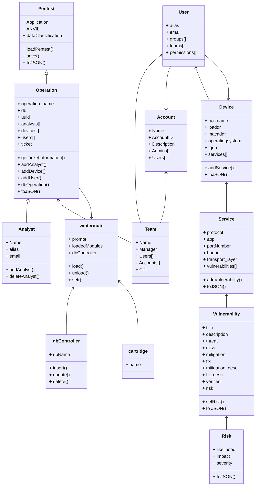

# Welcome to wintermute’s documentation!

## Usage

Access to console can be done from the `wintermuteConsole` executable

```bash
./wintermuteConsole
```

Docker command line is

```bash
docker run -it --rm -v $(pwd):/opt/wintermute
```

# Design

The current class structure is the following:



## What does it do now?

The current modules are:

- Kalamari: Intelligence gathering
- NestingPet: Penetration Testing module
- tCorp: Ticketing system module, it can search, comment, change status and create tickets.
- bluefalcon: Reporting module, it'll create an operational report for the output of the red team operation, including intelligence gathering, output can be a word document or an excel document.

## User requirements

The library should be able to be imported in both "import wintermute", "from wintermute import \*", and "from wintermute import core".

Importing as a normal library and showing the classes and objects including "core", "database" and "wintermute" modules and objects inside of it.

```python
Python 3.10.6 (main, Aug 11 2022, 13:49:25) [Clang 13.1.6 (clang-1316.0.21.2.5)] on darwin
Type "help", "copyright", "credits" or "license" for more information.
>>> import wintermute
>>> c = wintermute.wintermute()
>>> f = wintermute.core.
wintermute.core.Analyst(         wintermute.core.Operation(       wintermute.core.Query()
wintermute.core.TinyDB(          wintermute.core.ipaddress        wintermute.core.re
wintermute.core.vulnerability()
wintermute.core.Device(          wintermute.core.Pentest(         wintermute.core.Service(
wintermute.core.User()           wintermute.core.logging          wintermute.core.uuid
>>> f = wintermute.
wintermute.abspath(   wintermute.basename(  wintermute.core
wintermute.database   wintermute.dirname(   wintermute.isfile(
wintermute.join(      wintermute.wintermute  wintermute.path
>>> f = wintermute.database.
wintermute.database.CommandSet()            wintermute.database.TinyDB(
wintermute.database.cmd2                    wintermute.database.logging
wintermute.database.with_category(
wintermute.database.Query()                 wintermute.database.argparse
wintermute.database.dbBackend(              wintermute.database.with_argparser(
wintermute.database.with_default_category(
>>> quit()
```

Also it allows for \* importing, this still will only import modules and not the functions to remove the posibility of having a "dirty environment" and function overrides.

```python
>>> from wintermute import *
>>> c = wintermute.wintermute()
>>> f = core.Analyst('Enrique Sanchez', 'nahualito', 'enrique.sanchez@caissa-security.com')
>>> core.
core.Analyst(         core.Device(          core.Operation(
core.Pentest(         core.Query()          core.Service(
core.TinyDB(          core.User()           core.ipaddress
core.logging          core.re               core.uuid             core.vulnerability()
>>> wintermute.
wintermute.CommandSet()            wintermute.Operation(              wintermute.basename(
wintermute.cmd2                    wintermute.dirname(                wintermute.importlib
wintermute.isfile(                 wintermute.modules                 wintermute.sys
wintermute.with_category(
wintermute.CurrentOperation        wintermute.argparse                wintermute.cartridges
wintermute.dbBackend(              wintermute.glob                    wintermute.inspect
wintermute.join(                   wintermute.wintermute(              wintermute.with_argparser(
wintermute.with_default_category(
>>> quit()
```

# REPL Console

## wintermute

The following classes and functions are the main entry point for wintermute,
the PRSSec OST offensive Deck.

Cartridges are to be dropped in the cartridges folder and internal classes
should be dropped into the core file.

**WARNING call out method has changed from python3 -m wintermute into using the binary wintermuteConsole**

```bash
nahualito@88665a364f90 > ~/projects/wintermute $ ./wintermuteConsole
wintermute> help

Documented commands (use 'help -v' for verbose/'help <topic>' for details):

Command Loading
===============
load

Uncategorized
=============
alias  help     macro  run_pyscript  set    shortcuts
edit   history  quit   run_script    shell  unload

wintermute> load
Usage: unload [-h] {sshodan, kalamari, DrCiml, tcorp}
Error: the following arguments are required: cmds

wintermute> quit
nahualito@88665a364f90 > ~/projects/wintermute $
```

# Documentation

## How to create documentation

wintermute uses sphinx to create it's documentation so just

```bash
cd docs
make html
```

The documentation will be created into the `docs/_build/html/index.html` file, as the development moves a lot
we do not include this documentation into our git but allow the user to create it as needed.

# Development

For full details on how the internals work, design and full class description and data flows, read [DEVELOPMENT](DEVELOPMENT.md) Design file. For further TODO and ROADMAP read the [ROADMAP](ROADMAP.md) file
